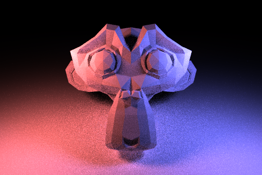
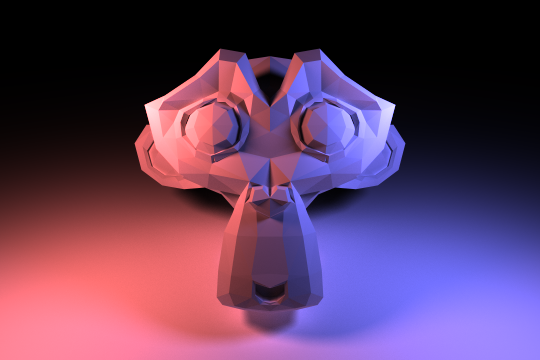
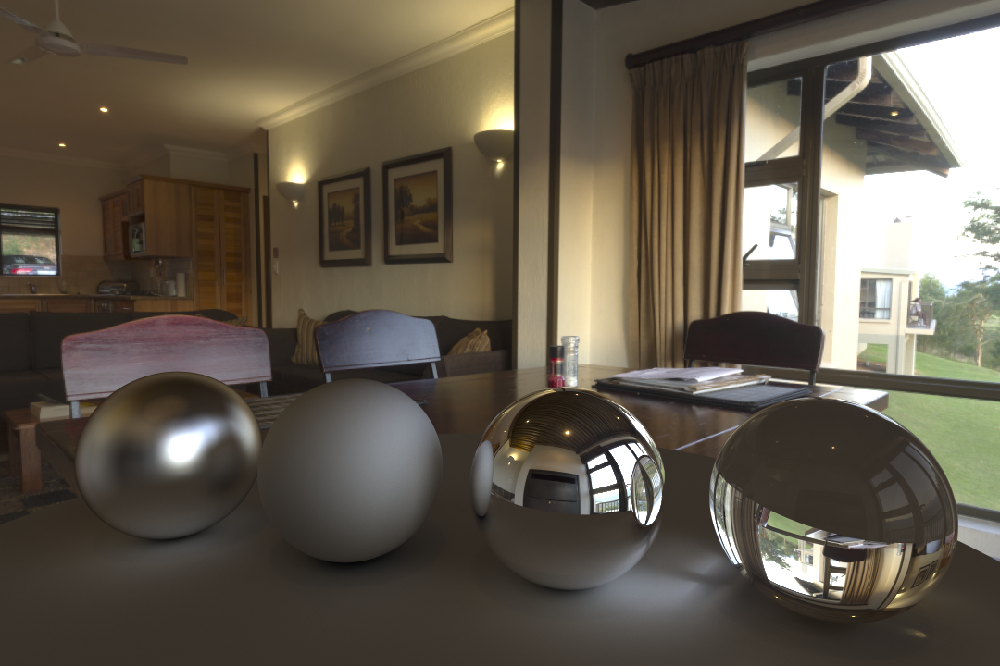

# Cray Tracer
A simple path tracer

## Path Tracing
Here's a cool animation of two metals objects, a diffuse object, a glass (dielectric) object and an emissive light source!

## Sampling
Monte Carlo integration with one sample will have a lot of noise. Here's a comparison of 16x AA, 1 sample vs. 16x AA, 256 samples:

## HDRI Backgrounds
To add backgrounds to the scenes, an HDRI was spherically mapped to an infinite-radius sphere. Radience information can then be extracted from the HDRI (with your favourite tone-mapping function) to create a lit scene. Here's an example. Notice the reflection of the other half of the scene in the shiny metal ball, and the refaction of the room lights and window light through the glass ball.

(image obtained via HDRI Haven)
